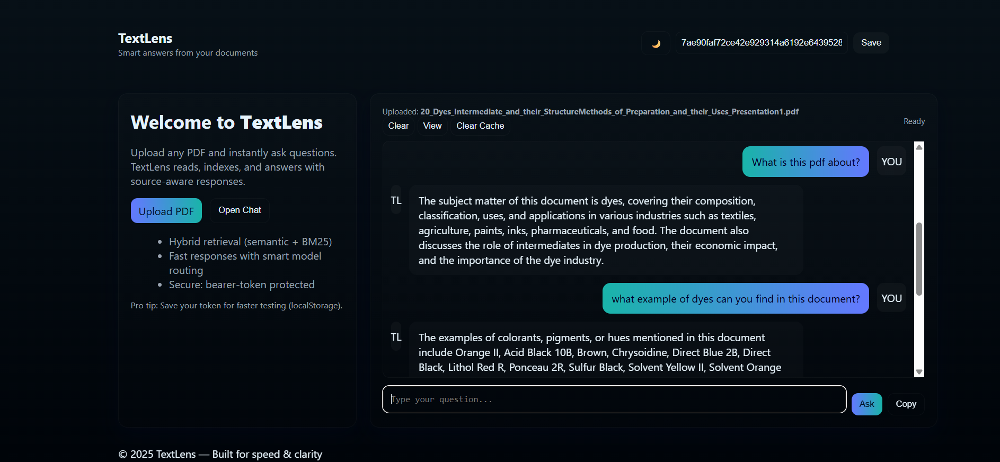
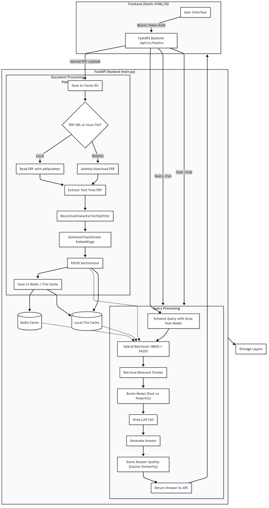

# 📚 TextLens – AI-Powered Text Analysis

**TextLens** is an AI-powered text analysis and summarization tool built with **FastAPI** and integrated with **Groq’s LLM API** for lightning-fast, context-aware results.  
It allows users to **analyze, summarize, and transform** text through an intuitive web interface.

---

## 🚀 Features
- **Text Summarization** – Condense large text into concise summaries.
- **Text Analysis** – Extract key points, sentiment, and context.
- **Text Transformation** – Rephrase or adapt text for different needs.
- **FastAPI Backend** – High-performance, asynchronous API server.
- **Groq LLM Integration** – Harness the speed and intelligence of Groq’s AI models.
- **Secure Config** – Store API keys in `.env` to keep credentials safe.

---

## 🛠️ Tech Stack
**Backend**:
- [FastAPI](https://fastapi.tiangolo.com/) – Async, fast, Python web framework.
- [Groq API](https://groq.com/) – Large language model API.
- [aiohttp](https://docs.aiohttp.org/) – Async HTTP client.
- [pdfplumber](https://github.com/jsvine/pdfplumber) – Extract text from PDFs.

**Frontend**:
- HTML, CSS, JavaScript – Simple, responsive UI.
- Fetch API for real-time interaction with FastAPI endpoints.

**Other Tools**:
- `python-dotenv` – Environment variable management.
- ThreadPoolExecutor – Efficient background processing.

---
## Preview


---

## Architecture Diagram


---

## 📂 Project Structure
```txt
Textlens/
│── app/
│ ├── main.py # FastAPI entry point
│ ├── routes/ # API routes
│ ├── services/ # LLM and PDF processing logic
│── static/ # CSS, JS, images
│── templates/ # HTML frontend
│── requirements.txt # Python dependencies
│── .env.example # Example environment variables
│── README.md # Project documentation
```

## ⚡ Quick Start

### 1️⃣ Clone the repository
```bash
git clone https://github.com/yashpawar2108/Textlens.git
cd Textlens
```
### 2️⃣ Install dependencies
bash
Copy
Edit
```bash
pip install -r requirements.txt
```
### 3️⃣ Configure environment variables
Create a .env file in the root directory:
```ini
GROQ_API_KEY=your_groq_api_key_here
```
### 4️⃣ Run the FastAPI server
```bash
uvicorn app.main:app --reload
```
Server will start at: http://127.0.0.1:8000

---

## 🖥️ Usage
1. Open your browser at **[http://127.0.0.1:8000](http://127.0.0.1:8000)**
2. Paste or upload text/PDF
3. Choose an action:
   - **Summarize** text
   - **Analyze** sentiment and context
   - **Transform** text style/tone
4. Get instant results powered by **Groq LLM** 🚀

---

## 🔒 Security
- Keep your `.env` file private and **never commit it to Git**.
- Add `.env` to `.gitignore` to prevent sensitive information from being tracked.

---

## 📜 License
This project is licensed under the **MIT License** – see the [LICENSE](LICENSE) file for details.

---

## 🤝 Contributing
Contributions are welcome!  
1. Fork the repo  
2. Create a new branch:  
   ```bash
   git checkout -b feature/awesome-feature
   ```
